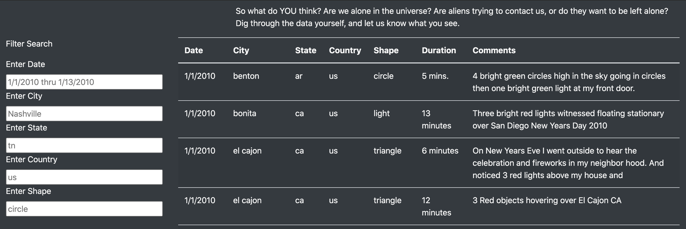
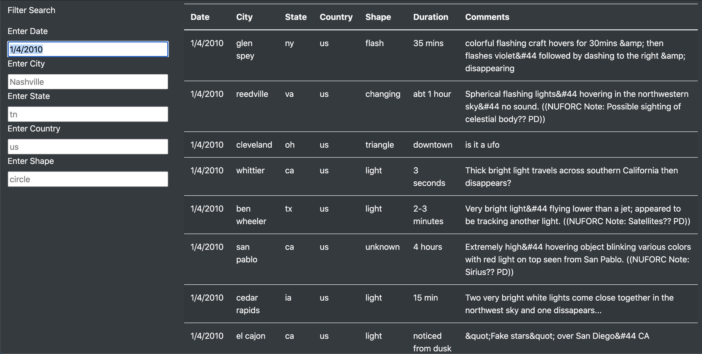
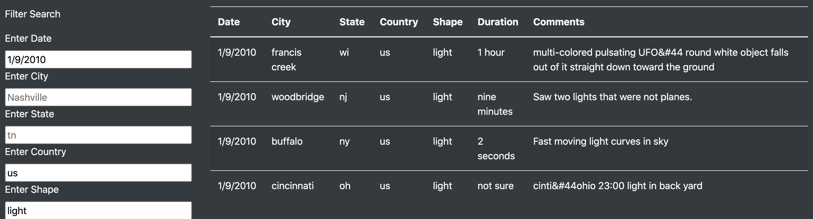
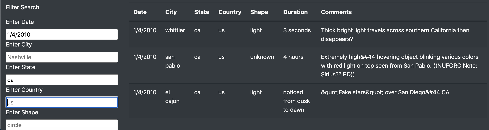

# UFO_Analysis
## Analysis Overview #
This project refines a javascript data set of UFO observations and creates a dynamic table in HTML that allows the curious observer to search for other similar UFO occurrences. The data set of this project covers a scope of 2 weeks in January of 2010, as is clarified in the filter on the page. The table can filter UFO observations by the following criteria. 

### Filter Criteria ###
<ul>
    <li>The <b>date</b> of occurrence</li>
    <li>The nearest <b>city</b></li>
    <li>The <b>state</b> in which it took place</li>
    <li>The <b>country</b></il>
    <li>The <b>shape</b> of the supposed UFO</li>
</ul>

## Results ##
Using the above filter criteria, the curious user can filter through the collected data by any combination or individual criteria. The javascript “listens” for updates to the filters using the <b>d3</b> package.    
The clean table head and filter look like this. 
<table><tr>
<td>  </td>
</tr></table>

The user can filter by a single criteria, such as date, like this search below.  
<table><tr>
<td>  </td>
</tr></table>

The user can also filter by multiple or all criteria. Here are two examples where a search was done by Date and Shape, and another by Date and State.  
<table><tr>
<td>  </td>
<td>  </td>
</tr></table>